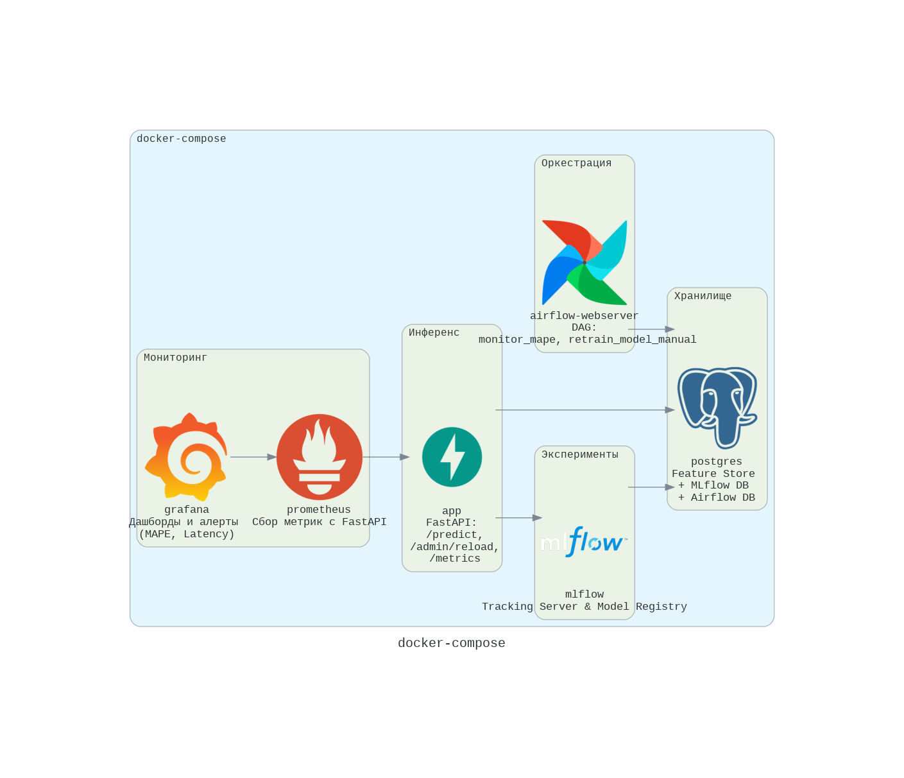
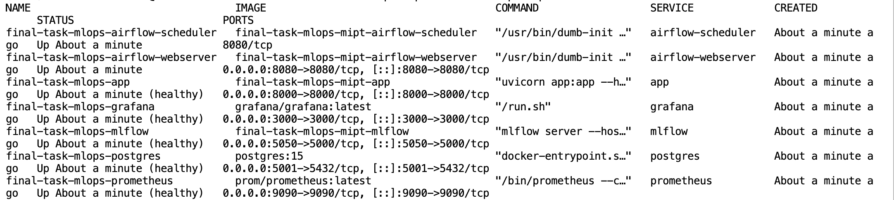
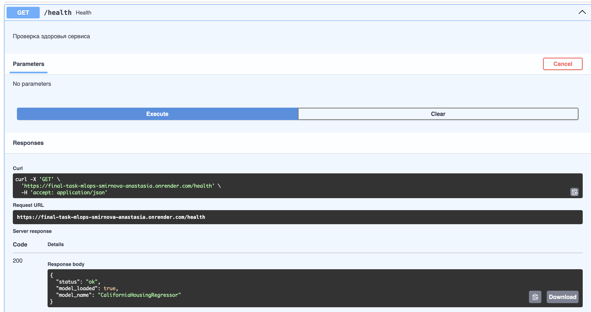
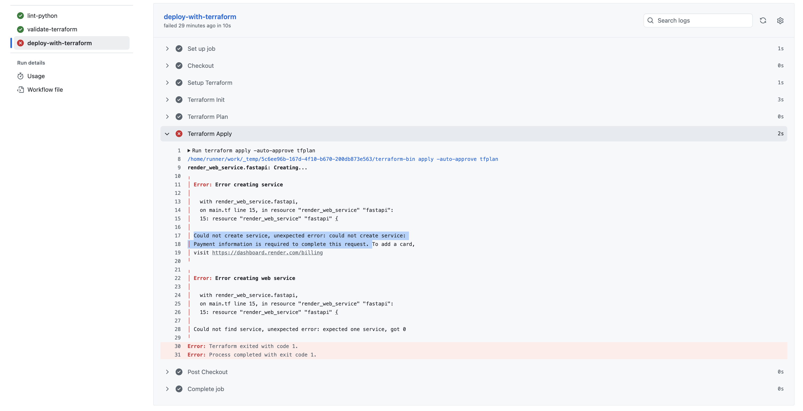

# ML-система прогнозирования стоимости жилья (California Housing)

## Краткое описание

ML-сервис позволяет быстро получать объективную оценку стоимости жилья в Калифорнии на основе характеристик дома и района. Система автоматизирует полный жизненный цикл модели: от экспериментов до мониторинга в продакшене и переобучения при деградации качества.

## Архитектура

| Компонент | Назначение |
|-----------|------------|
| **Apache Airflow** | Оркестрация: мониторинг MAPE (ежечасный DAG) и ручное переобучение модели |
| **MLflow** | Tracking Server + Model Registry (Staging -> Production -> Archived) |
| **FastAPI** | REST API для инференса (`/predict`, `/predict_batch`, `/health`, `/admin/reload`) |
| **PostgreSQL** | Feature Store (таблицы `features`, `scalers`) + метаданные MLflow и Airflow |
| **Prometheus + Grafana** | Сбор метрик (MAPE, latency) и визуализация; настроены алерты |
| **Docker Compose** | Контейнеризация всех сервисов |
| **GitHub Actions** | CI/CD: линтинг (ruff), валидация Terraform, сборка Docker-образа, деплой на Render |
| **Terraform** | Infrastructure as Code для развёртывания в облаке Render |



## Быстрый старт

### Локальный запуск

```bash
git clone https://github.com/steishas/final-task-mlops-smirnova-anastasia.git
cd final-task-mlops-smirnova-anastasia
docker compose up -d
```

После запуска доступны:

- `MLflow UI`: http://localhost:5050
- `Airflow UI`: http://localhost:8080 (admin / admin)
- `FastAPI Swagger`: http://localhost:8000/docs
- `Prometheus`: http://localhost:9090
- `Grafana`: http://localhost:3000 (admin / admin)



### Облачный сервис
Развёрнут на Render: `https://final-task-mlops-smirnova-anastasia.onrender.com/docs`

Ответ эндпоинта `/health`:


Для демонстрации был написан terraform для деплой через API, однако Render требует данных кредитной карты для деплоя через API, поэтмоу джоба `Terraform Apply` упала с ошибкой: 


Деплой был завершен вручную через UI Render.
[Ссылка на CI/CD](https://github.com/steishas/final-task-mlops-smirnova-anastasia/actions/runs/26685554989) 

## Структура проекта

```text
├── app.py                      # FastAPI-сервис
├── train_model.py              # Скрипт обучения и регистрации модели
├── monitor_and_retrain.py      # Мониторинг MAPE и подготовка данных
├── model.pkl                   # Упакованная модель для облачного деплоя
├── docker-compose.yml          # Локальный стек
├── Dockerfile                  # FastAPI + модель (для облака)
├── Dockerfile.airflow          # Airflow
├── Dockerfile.mlflow           # MLflow Tracking Server
├── requirements.txt            # Зависимости FastAPI
├── prometheus.yaml             # Конфигурация Prometheus
├── grafana.yml                 # Data source Grafana
├── dags/                       # DAG'и Airflow
│   ├── monitor_mape_dag.py     # Автоматический мониторинг
│   └── retrain_dag.py          # Ручное переобучение
├── data/
│   └── init.sql                # Инициализация Feature Store
├── model-experiments/          # Ноутбуки и скрипты экспериментов
├── dashboards/                 # JSON-модели дашбордов Grafana
├── terraform/                  # Terraform-конфигурация для Render
│   ├── main.tf
│   └── variables.tf
├── docs/
│   ├── adr/
│   │   ├── 001-model-choice.md         # ADR: выбор LightGBM
│   │   └── 002-latency-improvement.md  # ADR: улучшение времени отклика (MDD)
│   │── SLI-SLO.md                      # SLI/SLO на трёх уровнях
│   │── ml-manifest.md                  # Манифест ML-системы
├── pyproject.toml               # Конфигурация линтера ruff
├── img                          # Изображения и скриншоты
├── .github/workflows/
│   └── deploy.yml               # CI/CD пайплайн
└── README.md
```
## Метрики и SLO

| Уровень | SLI | SLO |
|---------|-----|-----|
| Бизнес | MAPE | < 20% |
| Модельный | $R^2$ | > 0.80 |
| Технический | Latency p95 | < 200 мс |

Подробнее: [docs/SLI-SLO.md](docs/SLI-SLO.md)

## Документация

- `Манифест ML-системы`: [ml-manifest.md](docs/ml-manifest.md)
- `ADR-001`: Выбор модели LightGBM: [docs/adr/001-model-choice.md](docs/adr/001-model-choice.md)
- `ADR-002`: Снижение времени отклика (MDD): [docs/adr/002-latency-improvement.md](docs/adr/002-latency-improvement.md)
- `SLI/SLO`: [docs/sli-slo.md](docs/SLI-SLO.md)

## Жизненный цикл модели
- Мониторинг: DAG `monitor_mape` (раз в час) генерирует синтетический батч с шумом, получает предсказания, вычисляет `MAPE` и отправляет метрику в Prometheus.
- Алерт: при MAPE > 20% Grafana отправляет уведомление.
- Подготовка данных: скрипт мониторинга создаёт полный зашумлённый датасет и логирует его в `MLflow`.
- Переобучение: инженер вручную запускает DAG `retrain_model_manual`, который загружает последний датасет, обучает новую версию `LightGBM`, регистрирует её в `MLflow Model Registry`.
- Промоушен: если `MAPE` новой модели < 20%, она переводится в `Production`, старая — в `Archived`.
- Обновление сервиса: `FastAPI` получает запрос `/admin/reload` и подгружает новую `Production`-модель.

## Используемые технологии
- `Python 3.11`, `LightGBM`, `scikit-learn`, `pandas`;
- `MLflow 2.13`, `Apache Airflow 2.9`;
- `FastAPI`, `Uvicorn`, `Prometheus`, `Grafana`;
- `PostgreSQL`, `Docker`, `Docker Compose`;
- `Terraform`, `GitHub Actions`;
- `Render` (облачный деплой).

**Автор**: Смирнова Анастасия, РМ2